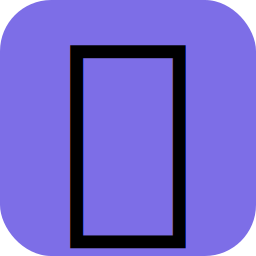
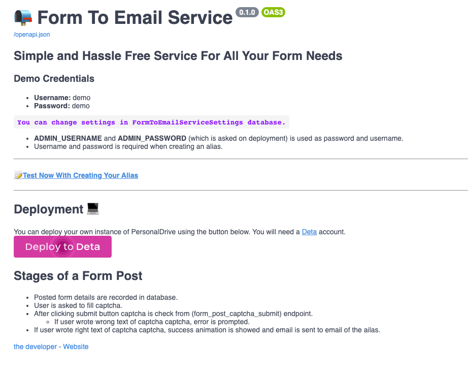
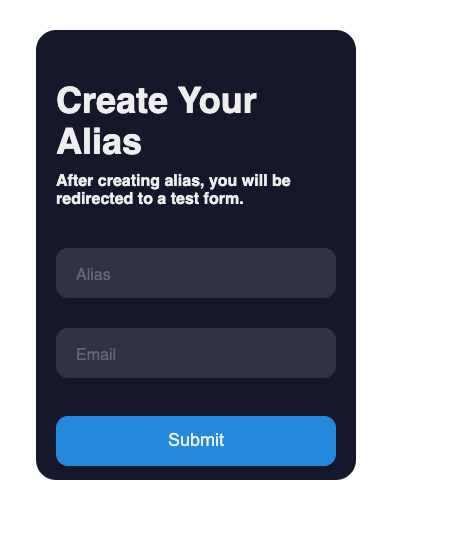
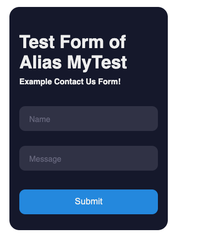
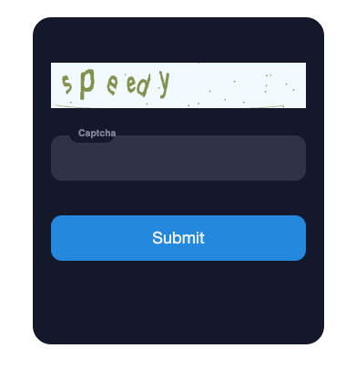
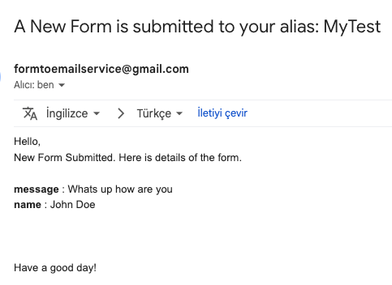

# Simple Form To Email Service 📨

> **Reliable** form service. Everytime your form is submitted, you will receive email.
>
> **Opensource**, working and free alternative of MailThis.to

## Features and Advantages

- **Built in spam protection**  with built in captcha (provided
  by [PrivateSimpleCaptchaApi](https://github.com/mehmetcanfarsak/PrivateSimpleCaptchaApi))
- Fast form submitting in milliseconds (Thanks to [DetaEventQueue](https://github.com/mehmetcanfarsak/DetaEventQueue))
- Create alias to protect your email from bots.
- Simple usage and quick setup
- Customize your forms to your liking
- Free and Secure [(Click to deploy **your
  instance**)](https://go.deta.dev/deploy?repo=https://github.com/mehmetcanfarsak/FormToEmailService)
- **Saves your time** (Don't hassle with servers)

## For Demo:

* Go to: [https://FormToEmailService.deta.dev](https://FormToEmailService.deta.dev)
* **Username:** demo
* **Password:** demo

### [📝Test Now With Creating Your Alias](https://FormToEmailService.deta.dev/create-test-alias)

## Usage

1. [Deploy your instance to Deta](https://go.deta.dev/deploy?repo=https://github.com/mehmetcanfarsak/FormToEmailService)
2. Create alias to your email
3. Create your Form however you want.
    * Create a form using HTML, a form builder, or use Javascript to generate POST requests that land in your inbox.
    * Make sure **action** attribute is set to `https://FormToEmailService.deta.dev/YourAlias`.
        * Example: `<form action="https://FormToEmailService.deta.dev/YourAlias" method="post">`
4. 🎉 Receive emails whenever your form is submitted.
5. You can change credentials, email settings etc in settings FormToEmailServiceSettings database.

## Use Cases

- Eliminate backend needs in your static websites (Create a simple html form and post it to this service).
- Use in Contact-Us Forms without complex notification setup
- Can be used in job application forms.

## Example Usages

### Html Form:

    <form action="https://FormToEmailService.deta.dev/YourAlias" 
        method="POST">
        <input type="email" name="email" placeholder="Your email">
        <input type="text" name="name" placeholder="Your name"> 
        <textarea name="message" placeholder="Enter your message here"></textarea>
        <input type="submit" value="Send"> 
    </form> 

### Ajax Request:

    

🏄 Also **You can deploy this project for free on Deta.Sh** Just click the link below 🛠️

### Check Api Documantation below: ⬇️

> **_Swagger UI:_**  [https://FormToEmailService.deta.dev/docs](https://FormToEmailService.deta.dev/docs "https://FormToEmailService.deta.dev/docs")

> **_ReDoc:_** [https://FormToEmailService.deta.dev/redoc](https://FormToEmailService.deta.dev/redoc "https://FormToEmailService.deta.dev/redoc")

### 💻 Github Page:

> [https://github.com/mehmetcanfarsak/FormToEmailService](https://github.com/mehmetcanfarsak/FormToEmailService "https://github.com/mehmetcanfarsak/FormToEmailService")

## Credits

* Captcha verification service made possible by PrivateSimpleCaptchaApi
    * 🔍 Check PrivateSimpleCaptchaApi
      on [https://PrivateSimpleCaptchaApi.deta.dev](https://PrivateSimpleCaptchaApi.deta.dev "https://PrivateSimpleCaptchaApi.deta.dev")  **
      without any limits 😈**  
      
* Background jobs made possible by [DetaEventQueue](https://github.com/mehmetcanfarsak/DetaEventQueue)
* Form Designs are inspired by [https://github.com/burakbb/deta-example](https://github.com/burakbb/deta-example)

## Pages

### [HomePage](https://FormToEmailService.deta.dev)

### [Creating Test Alias](https://FormToEmailService.deta.dev/create-test-alias)

### Test Form

### Spam Protection Page (Captcha)

### Example Email Sent From Form Submission

